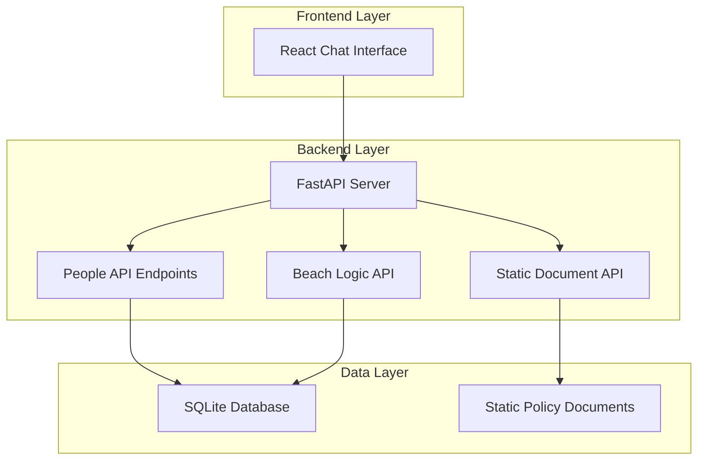

# Design Document

## Overview

The Agentic Implementation Platform is designed as a foundational system that provides the essential building blocks for multi-agent system development. The architecture follows a clean separation of concerns with a Python FastAPI backend, SQLite database, static file storage, and React frontend. The system is intentionally simple and extensible to serve as a launching point for implementing orchestrator agents, SQL query agents, API agents, and RAG document agents.

## Architecture

### High-Level Architecture



### Technology Stack

- **Backend**: Python 3.9+ with FastAPI framework
- **Database**: SQLite for structured data storage
- **Frontend**: React.js with modern hooks
- **API**: RESTful endpoints with JSON responses
- **Documentation**: Static file serving for policy documents

## Components and Interfaces

### Backend Components

#### 1. FastAPI Application Server

- **Purpose**: Main application server handling HTTP requests
- **Responsibilities**:
  - Route management and request handling
  - CORS configuration for frontend integration
  - Static file serving for documents

#### 2. Database Models and Schema

- **People Table Schema**:
  ```sql
  CREATE TABLE people (
      id INTEGER PRIMARY KEY AUTOINCREMENT,
      name TEXT NOT NULL,
      role TEXT NOT NULL,
      department TEXT NOT NULL,
      staffing_status TEXT NOT NULL CHECK (staffing_status IN ('staffed', 'bench', 'available')),
      created_at TIMESTAMP DEFAULT CURRENT_TIMESTAMP,
      updated_at TIMESTAMP DEFAULT CURRENT_TIMESTAMP
  );
  ```

#### 3. API Endpoints

- **People Management**:

  - `GET /api/people` - List all people
  - `POST /api/people` - Create new person
  - `GET /api/people/{id}` - Get person by ID
  - `PUT /api/people/{id}` - Update person
  - `DELETE /api/people/{id}` - Delete person

- **Beach Logic**:

  - `GET /api/beach` - Get list of people currently on the beach

- **Document Access**:
  - `GET /api/docs/{filename}` - Retrieve policy document

### Frontend Components

#### 1. Chat Interface Component

- **Purpose**: Provide user interaction interface for future agent integration
- **Features**:
  - Message input field
  - Message history display
  - Send button and enter key support
  - Basic styling for professional appearance

#### 2. App Shell

- **Purpose**: Main application container
- **Features**:
  - Navigation structure
  - Chat interface integration
  - Responsive layout

## Data Models

### People Model

```python
class Person:
    id: int
    name: str
    role: str
    department: str
    staffing_status: Literal['staffed', 'bench', 'available']
    created_at: datetime
    updated_at: datetime
```

### Beach Response Model

```python
class BeachResponse:
    people_on_beach: List[Person]
    total_count: int
    last_updated: datetime
```

## Error Handling

### Backend Error Handling

- **HTTP Status Codes**: Proper use of 200, 201, 400, 404, 500 status codes
- **Error Response Format**:
  ```json
  {
    "error": "Error type",
    "message": "Human readable error message",
    "details": "Additional context if applicable"
  }
  ```

### Frontend Error Handling

- **API Error Display**: Show user-friendly error messages
- **Network Error Handling**: Handle connection failures gracefully
- **Input Validation**: Client-side validation with server-side verification

## Testing Strategy

### Backend Testing

- **Unit Tests**: Test individual functions and methods
- **Integration Tests**: Test API endpoints with database interactions
- **Database Tests**: Verify CRUD operations and data integrity

### Frontend Testing

- **Component Tests**: Test React components in isolation
- **Integration Tests**: Test component interactions and API calls
- **User Interface Tests**: Verify chat interface functionality

## File Structure

```
agentic-platform/
├── backend/
│   ├── app/
│   │   ├── __init__.py
│   │   ├── main.py
│   │   ├── models.py
│   │   ├── database.py
│   │   └── routers/
│   │       ├── __init__.py
│   │       ├── people.py
│   │       ├── beach.py
│   │       └── documents.py
│   ├── static/
│   │   └── policies/
│   │       ├── employee-handbook.md
│   │       ├── code-of-conduct.md
│   │       └── security-policy.md
│   ├── requirements.txt
│   └── run.py
├── frontend/
│   ├── public/
│   ├── src/
│   │   ├── components/
│   │   │   ├── Chat/
│   │   │   │   ├── ChatInterface.js
│   │   │   │   └── ChatInterface.css
│   │   │   └── App.js
│   │   ├── services/
│   │   │   └── api.js
│   │   └── index.js
│   ├── package.json
│   └── package-lock.json
└── README.md
```

## Extension Points for Multi-Agent System

The platform is designed with specific extension points to accommodate the planned multi-agent architecture:

### 1. Orchestrator Agent Integration

- **WebSocket Support**: Can be added to FastAPI for real-time agent communication
- **Agent Registry**: Database table for tracking active agents and their capabilities
- **Task Queue**: Integration point for agent task management

### 2. SQL Query Agent

- **Database Abstraction**: Current database layer can be extended with query generation capabilities
- **Query Validation**: Framework for safe SQL query construction and execution
- **Result Formatting**: Standardized response formats for tabular data

### 3. API Agent Integration

- **Business Logic Layer**: Current beach API demonstrates pattern for complex business logic
- **Service Layer**: Abstraction for external API integrations
- **Data Transformation**: Pipeline for processing and combining multiple data sources

### 4. RAG Document Agent

- **Document Indexing**: Static document storage ready for search indexing
- **Content Processing**: Framework for document parsing and chunking
- **Retrieval Interface**: API endpoints designed for document query and retrieval

## Security Considerations

- **Input Validation**: All API inputs validated and sanitized
- **SQL Injection Prevention**: Use of parameterized queries
- **CORS Configuration**: Proper cross-origin resource sharing setup
- **File Access Control**: Restricted access to policy documents through API only
