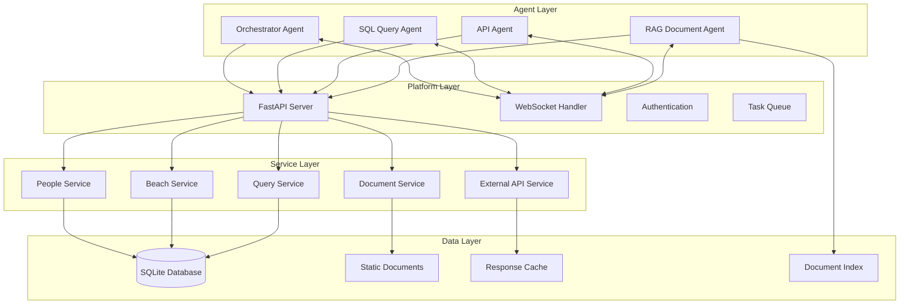

# Multi-Agent Integration Guide

This document provides detailed architectural guidance for extending the Agentic Implementation Platform with multi-agent capabilities. The platform is designed as a foundation that can be incrementally enhanced to support orchestrator agents, SQL query agents, API agents, and RAG document agents.

## Architecture Overview

The platform follows a modular architecture that supports agent integration through well-defined interfaces and extension points:



## Agent Integration Patterns

### 1. Orchestrator Agent

The orchestrator agent coordinates multiple specialized agents to fulfill complex user requests.

#### Integration Points

**WebSocket Communication:**

```python
# app/websocket.py
from fastapi import WebSocket, WebSocketDisconnect
from typing import Dict, List
import json

class AgentConnectionManager:
    def __init__(self):
        self.active_connections: Dict[str, WebSocket] = {}
        self.agent_capabilities: Dict[str, List[str]] = {}

    async def connect(self, websocket: WebSocket, agent_id: str, capabilities: List[str]):
        await websocket.accept()
        self.active_connections[agent_id] = websocket
        self.agent_capabilities[agent_id] = capabilities

    async def disconnect(self, agent_id: str):
        if agent_id in self.active_connections:
            del self.active_connections[agent_id]
            del self.agent_capabilities[agent_id]

    async def send_task(self, agent_id: str, task: dict):
        if agent_id in self.active_connections:
            await self.active_connections[agent_id].send_text(json.dumps(task))

    async def broadcast_event(self, event: dict, exclude_agent: str = None):
        for agent_id, websocket in self.active_connections.items():
            if agent_id != exclude_agent:
                await websocket.send_text(json.dumps(event))

manager = AgentConnectionManager()

@app.websocket("/ws/agents/{agent_id}")
async def agent_websocket(websocket: WebSocket, agent_id: str):
    capabilities = websocket.query_params.get("capabilities", "").split(",")
    await manager.connect(websocket, agent_id, capabilities)
    try:
        while True:
            data = await websocket.receive_text()
            message = json.loads(data)
            # Handle agent responses and coordination
            await handle_agent_message(agent_id, message)
    except WebSocketDisconnect:
        await manager.disconnect(agent_id)
```

**Task Queue System:**

```python
# app/task_queue.py
from enum import Enum
from datetime import datetime
from typing import Optional, Dict, Any
import asyncio
import uuid

class TaskStatus(Enum):
    PENDING = "pending"
    IN_PROGRESS = "in_progress"
    COMPLETED = "completed"
    FAILED = "failed"

class Task:
    def __init__(self, task_type: str, payload: Dict[Any, Any],
                 assigned_agent: Optional[str] = None):
        self.id = str(uuid.uuid4())
        self.task_type = task_type
        self.payload = payload
        self.assigned_agent = assigned_agent
        self.status = TaskStatus.PENDING
        self.created_at = datetime.utcnow()
        self.completed_at: Optional[datetime] = None
        self.result: Optional[Dict[Any, Any]] = None
        self.error: Optional[str] = None

class TaskQueue:
    def __init__(self):
        self.tasks: Dict[str, Task] = {}
        self.pending_tasks: asyncio.Queue = asyncio.Queue()

    async def enqueue_task(self, task: Task) -> str:
        self.tasks[task.id] = task
        await self.pending_tasks.put(task)
        return task.id

    async def assign_task(self, agent_id: str) -> Optional[Task]:
        try:
            task = await asyncio.wait_for(self.pending_tasks.get(), timeout=1.0)
            task.assigned_agent = agent_id
            task.status = TaskStatus.IN_PROGRESS
            return task
        except asyncio.TimeoutError:
            return None

    def complete_task(self, task_id: str, result: Dict[Any, Any]):
        if task_id in self.tasks:
            task = self.tasks[task_id]
            task.status = TaskStatus.COMPLETED
            task.result = result
            task.completed_at = datetime.utcnow()

    def fail_task(self, task_id: str, error: str):
        if task_id in self.tasks:
            task = self.tasks[task_id]
            task.status = TaskStatus.FAILED
            task.error = error
            task.completed_at = datetime.utcnow()

task_queue = TaskQueue()
```

#### Implementation Steps

1. **Add WebSocket Support:**

   - Install `websockets` dependency
   - Create WebSocket endpoint for agent connections
   - Implement connection management and heartbeat system

2. **Create Agent Registry:**

   - Add `agents` table to database schema
   - Implement agent registration and capability tracking
   - Add agent health monitoring

3. **Implement Task Coordination:**
   - Create task queue system for agent work distribution
   - Add task result aggregation and response composition
   - Implement error handling and retry logic

### 2. SQL Query Agent

The SQL query agent converts natural language queries into safe SQL operations and returns structured results.

#### Integration Points

**Query Generation Service:**

```python
# app/services/sql_agent.py
from typing import List, Dict, Any, Optional
import re
import sqlite3
from app.database import get_db_connection

class SQLQueryAgent:
    def __init__(self):
        self.allowed_tables = ['people']
        self.allowed_operations = ['SELECT']
        self.query_templates = {
            'list_people': "SELECT * FROM people WHERE {conditions}",
            'count_people': "SELECT COUNT(*) FROM people WHERE {conditions}",
            'people_by_department': "SELECT department, COUNT(*) FROM people GROUP BY department",
            'people_by_status': "SELECT staffing_status, COUNT(*) FROM people GROUP BY staffing_status"
        }

    def parse_natural_language(self, query: str) -> Dict[str, Any]:
        """Convert natural language to query parameters."""
        query_lower = query.lower()

        # Extract intent
        if 'count' in query_lower or 'how many' in query_lower:
            intent = 'count_people'
        elif 'department' in query_lower and 'group' in query_lower:
            intent = 'people_by_department'
        elif 'status' in query_lower and 'group' in query_lower:
            intent = 'people_by_status'
        else:
            intent = 'list_people'

        # Extract conditions
        conditions = []
        if 'engineering' in query_lower:
            conditions.append("department = 'Engineering'")
        if 'available' in query_lower:
            conditions.append("staffing_status = 'available'")
        if 'bench' in query_lower:
            conditions.append("staffing_status = 'bench'")

        return {
            'intent': intent,
            'conditions': ' AND '.join(conditions) if conditions else '1=1'
        }

    def validate_query(self, sql_query: str) -> bool:
        """Validate SQL query for security and allowed operations."""
        sql_upper = sql_query.upper()

        # Check for allowed operations only
        if not any(op in sql_upper for op in self.allowed_operations):
            return False

        # Check for dangerous keywords
        dangerous_keywords = ['DROP', 'DELETE', 'UPDATE', 'INSERT', 'ALTER', 'CREATE']
        if any(keyword in sql_upper for keyword in dangerous_keywords):
            return False

        # Check for allowed tables only
        for table in self.allowed_tables:
            if table.upper() in sql_upper:
                return True

        return False

    async def execute_query(self, natural_language_query: str) -> Dict[str, Any]:
        """Execute natural language query and return results."""
        try:
            # Parse natural language to query parameters
            query_params = self.parse_natural_language(natural_language_query)

            # Generate SQL from template
            template = self.query_templates.get(query_params['intent'])
            if not template:
                return {'error': 'Query intent not supported'}

            sql_query = template.format(conditions=query_params['conditions'])

            # Validate query
            if not self.validate_query(sql_query):
                return {'error': 'Query validation failed'}

            # Execute query
            with get_db_connection() as conn:
                cursor = conn.cursor()
                cursor.execute(sql_query)

                if query_params['intent'].startswith('count'):
                    result = cursor.fetchone()[0]
                    return {'result': result, 'type': 'scalar'}
                else:
                    columns = [description[0] for description in cursor.description]
                    rows = cursor.fetchall()
                    return {
                        'result': [dict(zip(columns, row)) for row in rows],
                        'type': 'table',
                        'columns': columns
                    }

        except Exception as e:
            return {'error': str(e)}

sql_agent = SQLQueryAgent()
```

**API Integration:**

```python
# app/routers/sql_agent.py
from fastapi import APIRouter, HTTPException
from pydantic import BaseModel
from app.services.sql_agent import sql_agent

router = APIRouter(prefix="/api/sql", tags=["SQL Agent"])

class QueryRequest(BaseModel):
    query: str

@router.post("/query")
async def execute_natural_language_query(request: QueryRequest):
    """Execute a natural language query against the database."""
    result = await sql_agent.execute_query(request.query)

    if 'error' in result:
        raise HTTPException(status_code=400, detail=result['error'])

    return result
```

#### Implementation Steps

1. **Extend Database Service:**

   - Add query parsing and validation utilities
   - Implement query template system for common operations
   - Add query result caching for performance

2. **Create Natural Language Processing:**

   - Implement basic NLP for query intent recognition
   - Add entity extraction for database fields
   - Create query parameter mapping

3. **Add Security Layer:**
   - Implement SQL injection prevention
   - Add query complexity limits
   - Create audit logging for all queries

### 3. API Agent

The API agent integrates with external APIs and combines data from multiple sources.

#### Integration Points

**External API Service:**

```python
# app/services/api_agent.py
import httpx
import asyncio
from typing import Dict, List, Any, Optional
from datetime import datetime, timedelta
import json

class APIAgent:
    def __init__(self):
        self.registered_apis: Dict[str, Dict] = {}
        self.response_cache: Dict[str, Dict] = {}
        self.rate_limits: Dict[str, Dict] = {}

    def register_api(self, name: str, config: Dict[str, Any]):
        """Register an external API for use by the agent."""
        self.registered_apis[name] = {
            'base_url': config['base_url'],
            'auth': config.get('auth', {}),
            'rate_limit': config.get('rate_limit', {'requests_per_minute': 60}),
            'timeout': config.get('timeout', 30),
            'retry_count': config.get('retry_count', 3)
        }

    async def call_api(self, api_name: str, endpoint: str,
                      method: str = 'GET', **kwargs) -> Dict[str, Any]:
        """Make a call to a registered external API."""
        if api_name not in self.registered_apis:
            return {'error': f'API {api_name} not registered'}

        api_config = self.registered_apis[api_name]

        # Check rate limits
        if not self._check_rate_limit(api_name):
            return {'error': 'Rate limit exceeded'}

        # Check cache
        cache_key = f"{api_name}:{endpoint}:{json.dumps(kwargs, sort_keys=True)}"
        if cache_key in self.response_cache:
            cached_response = self.response_cache[cache_key]
            if datetime.utcnow() < cached_response['expires_at']:
                return cached_response['data']

        # Make API call
        try:
            async with httpx.AsyncClient(timeout=api_config['timeout']) as client:
                url = f"{api_config['base_url']}/{endpoint.lstrip('/')}"

                # Add authentication
                headers = kwargs.get('headers', {})
                if 'auth' in api_config and api_config['auth']:
                    if api_config['auth']['type'] == 'bearer':
                        headers['Authorization'] = f"Bearer {api_config['auth']['token']}"
                    elif api_config['auth']['type'] == 'api_key':
                        headers[api_config['auth']['header']] = api_config['auth']['key']

                response = await client.request(
                    method=method,
                    url=url,
                    headers=headers,
                    **{k: v for k, v in kwargs.items() if k != 'headers'}
                )

                response.raise_for_status()
                result = response.json()

                # Cache successful response
                self.response_cache[cache_key] = {
                    'data': result,
                    'expires_at': datetime.utcnow() + timedelta(minutes=5)
                }

                return result

        except Exception as e:
            return {'error': str(e)}

    def _check_rate_limit(self, api_name: str) -> bool:
        """Check if API call is within rate limits."""
        now = datetime.utcnow()
        if api_name not in self.rate_limits:
            self.rate_limits[api_name] = {'calls': [], 'window_start': now}

        rate_limit_info = self.rate_limits[api_name]
        api_config = self.registered_apis[api_name]

        # Clean old calls outside the window
        window_minutes = 1  # 1-minute window
        cutoff_time = now - timedelta(minutes=window_minutes)
        rate_limit_info['calls'] = [
            call_time for call_time in rate_limit_info['calls']
            if call_time > cutoff_time
        ]

        # Check if we can make another call
        max_calls = api_config['rate_limit']['requests_per_minute']
        if len(rate_limit_info['calls']) >= max_calls:
            return False

        # Record this call
        rate_limit_info['calls'].append(now)
        return True

    async def compose_data(self, composition_config: Dict[str, Any]) -> Dict[str, Any]:
        """Compose data from multiple API sources."""
        results = {}

        # Execute API calls in parallel where possible
        tasks = []
        for source_name, source_config in composition_config['sources'].items():
            task = self.call_api(
                source_config['api'],
                source_config['endpoint'],
                source_config.get('method', 'GET'),
                **source_config.get('params', {})
            )
            tasks.append((source_name, task))

        # Wait for all API calls to complete
        for source_name, task in tasks:
            results[source_name] = await task

        # Apply transformations
        if 'transformations' in composition_config:
            for transformation in composition_config['transformations']:
                results = self._apply_transformation(results, transformation)

        return results

    def _apply_transformation(self, data: Dict[str, Any],
                            transformation: Dict[str, Any]) -> Dict[str, Any]:
        """Apply data transformation rules."""
        # Simple transformation examples
        if transformation['type'] == 'merge':
            # Merge multiple sources into one result
            merged = {}
            for source in transformation['sources']:
                if source in data and 'error' not in data[source]:
                    merged.update(data[source])
            return {transformation['output']: merged}

        elif transformation['type'] == 'filter':
            # Filter data based on conditions
            source_data = data.get(transformation['source'], {})
            if 'error' not in source_data:
                filtered = [
                    item for item in source_data
                    if self._matches_filter(item, transformation['conditions'])
                ]
                data[transformation['output']] = filtered

        return data

    def _matches_filter(self, item: Dict, conditions: List[Dict]) -> bool:
        """Check if item matches filter conditions."""
        for condition in conditions:
            field = condition['field']
            operator = condition['operator']
            value = condition['value']

            if field not in item:
                return False

            item_value = item[field]

            if operator == 'equals' and item_value != value:
                return False
            elif operator == 'contains' and value not in str(item_value):
                return False
            elif operator == 'greater_than' and item_value <= value:
                return False

        return True

api_agent = APIAgent()
```

#### Implementation Steps

1. **Create API Registry:**

   - Add external API configuration management
   - Implement authentication handling for different API types
   - Add API health monitoring and fallback strategies

2. **Add Data Composition:**

   - Create data transformation pipeline
   - Implement parallel API call execution
   - Add result caching and optimization

3. **Implement Rate Limiting:**
   - Add per-API rate limiting
   - Implement request queuing for high-volume scenarios
   - Create monitoring and alerting for API usage

### 4. RAG Document Agent

The RAG agent provides semantic search and retrieval capabilities over the document collection.

#### Integration Points

**Document Indexing Service:**

```python
# app/services/rag_agent.py
import os
import hashlib
from typing import List, Dict, Any, Optional
from datetime import datetime
import json
import re

class DocumentChunk:
    def __init__(self, content: str, metadata: Dict[str, Any]):
        self.content = content
        self.metadata = metadata
        self.embedding: Optional[List[float]] = None
        self.id = hashlib.md5(content.encode()).hexdigest()

class RAGAgent:
    def __init__(self, document_path: str):
        self.document_path = document_path
        self.chunks: Dict[str, DocumentChunk] = {}
        self.document_index: Dict[str, Dict] = {}
        self.keyword_index: Dict[str, List[str]] = {}

    def index_documents(self):
        """Index all documents in the document path."""
        for root, dirs, files in os.walk(self.document_path):
            for file in files:
                if file.endswith(('.md', '.txt', '.pdf')):
                    file_path = os.path.join(root, file)
                    self._index_document(file_path)

    def _index_document(self, file_path: str):
        """Index a single document."""
        try:
            with open(file_path, 'r', encoding='utf-8') as f:
                content = f.read()

            # Extract metadata
            metadata = {
                'file_path': file_path,
                'file_name': os.path.basename(file_path),
                'file_type': os.path.splitext(file_path)[1],
                'indexed_at': datetime.utcnow().isoformat(),
                'size': len(content)
            }

            # Chunk the document
            chunks = self._chunk_document(content, metadata)

            # Store chunks
            for chunk in chunks:
                self.chunks[chunk.id] = chunk
                self._update_keyword_index(chunk)

            # Update document index
            self.document_index[file_path] = {
                'metadata': metadata,
                'chunk_ids': [chunk.id for chunk in chunks],
                'chunk_count': len(chunks)
            }

        except Exception as e:
            print(f"Error indexing document {file_path}: {e}")

    def _chunk_document(self, content: str, metadata: Dict[str, Any]) -> List[DocumentChunk]:
        """Split document into chunks for better retrieval."""
        chunks = []

        # Simple chunking by paragraphs with overlap
        paragraphs = content.split('\n\n')
        chunk_size = 3  # Number of paragraphs per chunk
        overlap = 1     # Number of overlapping paragraphs

        for i in range(0, len(paragraphs), chunk_size - overlap):
            chunk_paragraphs = paragraphs[i:i + chunk_size]
            chunk_content = '\n\n'.join(chunk_paragraphs)

            if chunk_content.strip():
                chunk_metadata = metadata.copy()
                chunk_metadata.update({
                    'chunk_index': len(chunks),
                    'start_paragraph': i,
                    'end_paragraph': min(i + chunk_size - 1, len(paragraphs) - 1)
                })

                chunks.append(DocumentChunk(chunk_content, chunk_metadata))

        return chunks

    def _update_keyword_index(self, chunk: DocumentChunk):
        """Update keyword index for fast text search."""
        # Extract keywords (simple approach)
        words = re.findall(r'\b\w+\b', chunk.content.lower())

        for word in words:
            if len(word) > 3:  # Only index words longer than 3 characters
                if word not in self.keyword_index:
                    self.keyword_index[word] = []
                if chunk.id not in self.keyword_index[word]:
                    self.keyword_index[word].append(chunk.id)

    def search_documents(self, query: str, top_k: int = 5) -> List[Dict[str, Any]]:
        """Search documents using keyword matching."""
        query_words = re.findall(r'\b\w+\b', query.lower())

        # Score chunks based on keyword matches
        chunk_scores: Dict[str, float] = {}

        for word in query_words:
            if word in self.keyword_index:
                for chunk_id in self.keyword_index[word]:
                    if chunk_id not in chunk_scores:
                        chunk_scores[chunk_id] = 0
                    chunk_scores[chunk_id] += 1

        # Sort by score and return top results
        sorted_chunks = sorted(
            chunk_scores.items(),
            key=lambda x: x[1],
            reverse=True
        )[:top_k]

        results = []
        for chunk_id, score in sorted_chunks:
            chunk = self.chunks[chunk_id]
            results.append({
                'content': chunk.content,
                'metadata': chunk.metadata,
                'score': score,
                'chunk_id': chunk_id
            })

        return results

    def get_document_summary(self, file_path: str) -> Optional[Dict[str, Any]]:
        """Get summary information about a document."""
        if file_path in self.document_index:
            doc_info = self.document_index[file_path]

            # Get first chunk as preview
            first_chunk_id = doc_info['chunk_ids'][0] if doc_info['chunk_ids'] else None
            preview = ""
            if first_chunk_id and first_chunk_id in self.chunks:
                preview = self.chunks[first_chunk_id].content[:200] + "..."

            return {
                'file_path': file_path,
                'metadata': doc_info['metadata'],
                'chunk_count': doc_info['chunk_count'],
                'preview': preview
            }

        return None

    def list_documents(self) -> List[Dict[str, Any]]:
        """List all indexed documents."""
        return [
            self.get_document_summary(file_path)
            for file_path in self.document_index.keys()
        ]

# Initialize RAG agent
rag_agent = RAGAgent("backend/static/policies")
```

**API Integration:**

```python
# app/routers/rag_agent.py
from fastapi import APIRouter, HTTPException, Query
from pydantic import BaseModel
from typing import List, Optional
from app.services.rag_agent import rag_agent

router = APIRouter(prefix="/api/rag", tags=["RAG Agent"])

class SearchRequest(BaseModel):
    query: str
    top_k: Optional[int] = 5

@router.post("/search")
async def search_documents(request: SearchRequest):
    """Search documents using the RAG agent."""
    results = rag_agent.search_documents(request.query, request.top_k)
    return {
        'query': request.query,
        'results': results,
        'total_results': len(results)
    }

@router.get("/documents")
async def list_documents():
    """List all indexed documents."""
    return rag_agent.list_documents()

@router.get("/documents/{file_path:path}")
async def get_document_summary(file_path: str):
    """Get summary of a specific document."""
    summary = rag_agent.get_document_summary(f"backend/static/policies/{file_path}")
    if not summary:
        raise HTTPException(status_code=404, detail="Document not found")
    return summary

@router.post("/reindex")
async def reindex_documents():
    """Reindex all documents."""
    rag_agent.index_documents()
    return {"message": "Documents reindexed successfully"}
```

#### Implementation Steps

1. **Add Document Processing:**

   - Implement document chunking strategies
   - Add support for multiple document formats (PDF, DOCX, etc.)
   - Create document versioning and update detection

2. **Implement Search Capabilities:**

   - Add semantic search using embeddings (integrate with OpenAI or local models)
   - Implement hybrid search (keyword + semantic)
   - Add search result ranking and relevance scoring

3. **Create Document Management:**
   - Add document upload and management API
   - Implement document categorization and tagging
   - Create document access control and permissions

## Integration Workflow

### Step-by-Step Implementation

1. **Phase 1: Foundation Enhancement**

   - Add WebSocket support to FastAPI
   - Create agent registry database table
   - Implement basic task queue system

2. **Phase 2: Individual Agent Integration**

   - Implement SQL Query Agent with natural language processing
   - Add API Agent with external service integration
   - Create RAG Agent with document indexing

3. **Phase 3: Orchestrator Integration**

   - Implement orchestrator agent coordination logic
   - Add multi-agent workflow management
   - Create agent communication protocols

4. **Phase 4: Advanced Features**
   - Add agent learning and adaptation capabilities
   - Implement advanced caching and optimization
   - Create monitoring and analytics dashboard

### Testing Strategy

**Unit Testing:**

- Test individual agent services in isolation
- Mock external dependencies and APIs
- Validate data transformation and processing logic

**Integration Testing:**

- Test agent-to-agent communication
- Validate end-to-end workflows
- Test error handling and recovery scenarios

**Performance Testing:**

- Load test WebSocket connections
- Benchmark query processing times
- Test concurrent agent operations

## Security Considerations

### Agent Authentication

- Implement API key-based authentication for agents
- Add role-based access control (RBAC)
- Create audit logging for all agent operations

### Data Security

- Validate and sanitize all agent inputs
- Implement rate limiting per agent
- Add encryption for sensitive data transmission

### Query Security

- Prevent SQL injection in dynamic queries
- Limit database access to read-only operations
- Implement query complexity limits

## Monitoring and Observability

### Metrics Collection

- Track agent performance and response times
- Monitor API usage and rate limits
- Collect error rates and failure patterns

### Logging Strategy

- Structured logging for all agent operations
- Correlation IDs for tracing multi-agent workflows
- Centralized log aggregation and analysis

### Health Checks

- Agent heartbeat monitoring
- Service dependency health checks
- Automated failover and recovery procedures

## Deployment Considerations

### Containerization

- Create Docker containers for each agent type
- Implement container orchestration with Docker Compose or Kubernetes
- Add environment-specific configuration management

### Scalability

- Design for horizontal scaling of individual agents
- Implement load balancing for agent requests
- Add auto-scaling based on workload metrics

### High Availability

- Implement redundancy for critical agents
- Add circuit breaker patterns for external dependencies
- Create backup and disaster recovery procedures

This guide provides the foundation for transforming the Agentic Implementation Platform into a full multi-agent system. Each section can be implemented incrementally, allowing for gradual enhancement of the platform's capabilities.
